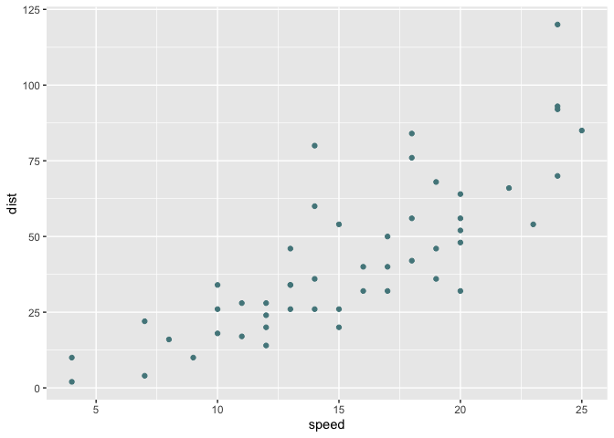
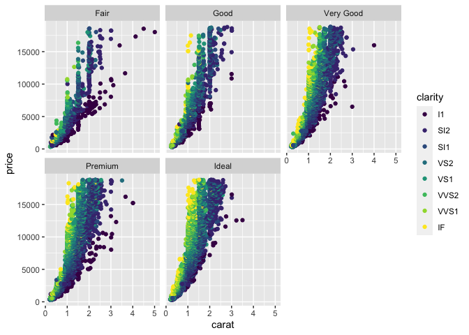

A sample RMD document
================

Loading my libraries nicely

``` r
suppressMessages(library(tidyverse))
```

This is a single English sentence

``` r
cars %>% 
  ggplot(aes(x=speed, y=dist)) +
  geom_point(col = "CadetBlue4")
```

<!-- -->

Playing with the diamonds dataset

``` r
diamonds %>% 
  ggplot(aes(x = carat, y = price, col = clarity)) +
  geom_point() +
  facet_wrap(~cut)
```

<!-- -->
